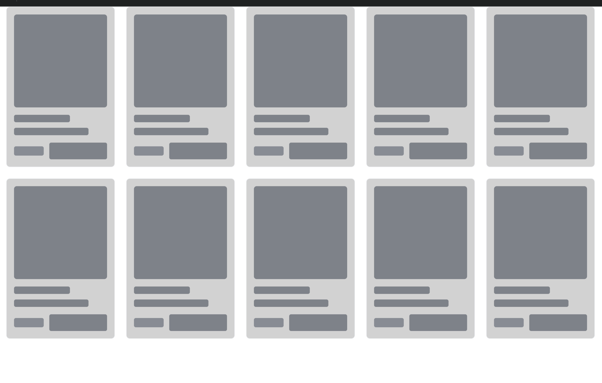
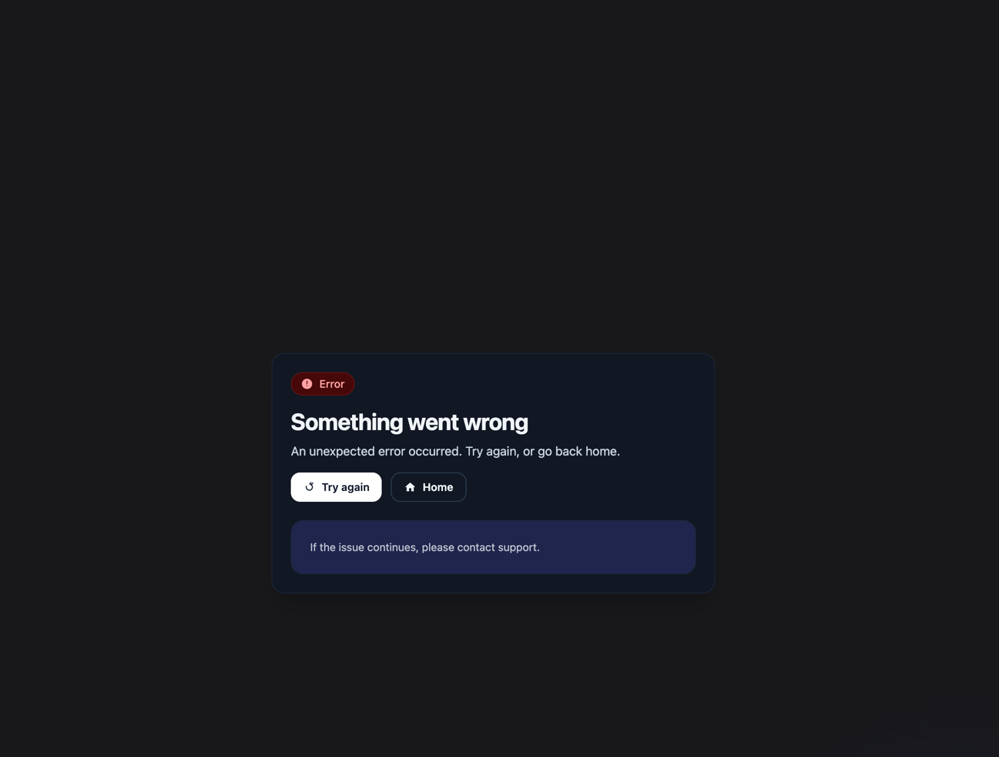
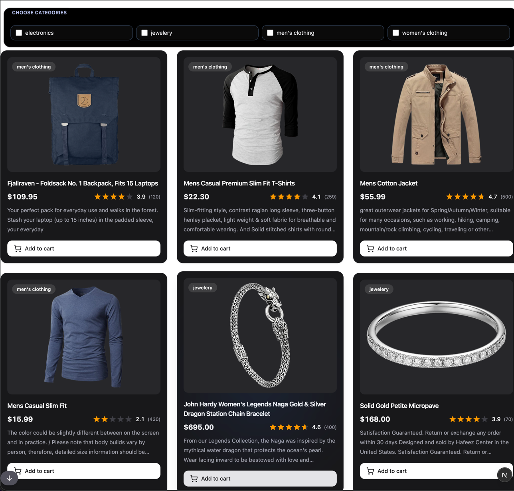
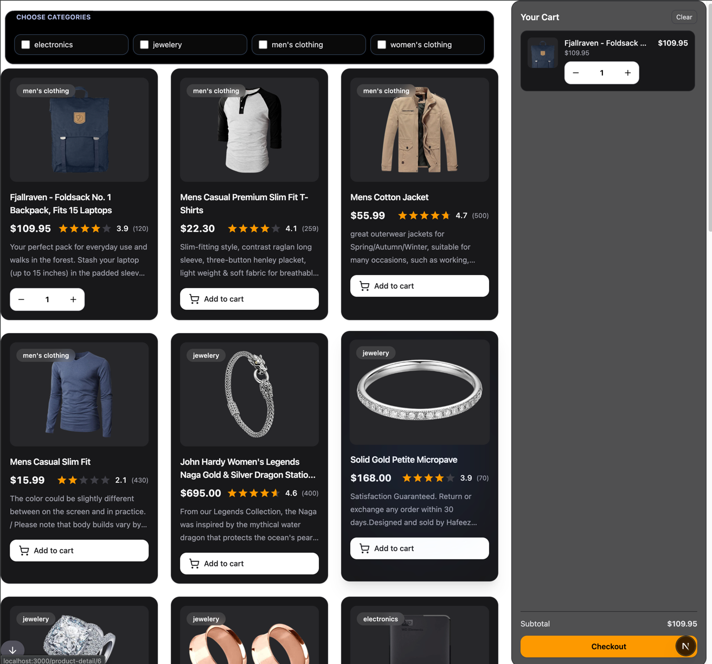
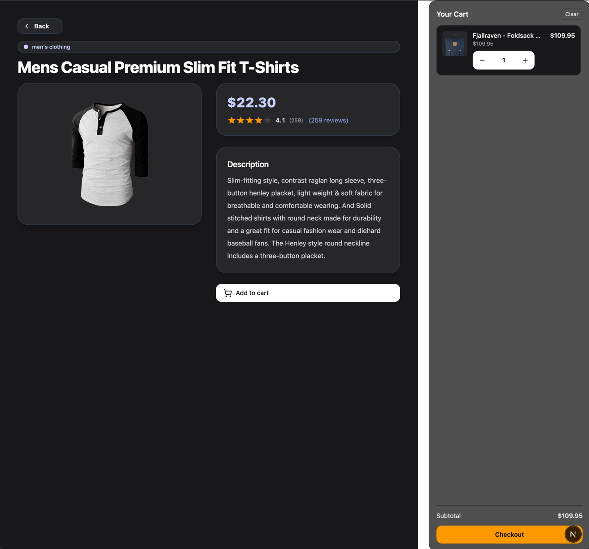
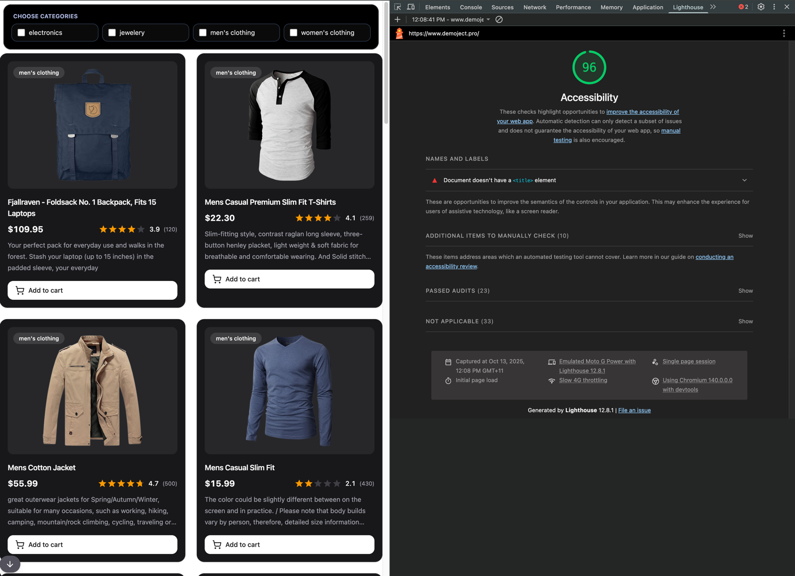

# Cubs eshop

An e-commerce application built with modern web technologies, featuring product listings, product details, and shopping cart functionality.

## Features

- Product catalog with filtering by categories
- Detailed product views with ratings
- Shopping cart management (add/remove products from the cart)
- Responsive UI with smooth animations
- Comprehensive test coverage

## Tech Stack

### Core Framework

- **Next.js 15** - React framework with App Router
- **React 19** - UI library
- **TypeScript** - Type-safe development

### State Management & Data Fetching

- **TanStack Query** - Server state management and data fetching
- **Jotai** - Atomic state management for client states

### Styling & UI

- **Tailwind CSS 4** - Utility-first CSS framework
- **Motion** - Animation library for smooth UI transitions
- **Lucide React** - Icon library

### Testing

- **Jest** - Testing framework
- **Testing Library** - React component testing utilities
- **MSW (Mock Service Worker)** - API mocking for tests

### Development Tools

- **ESLint** - Code linting
- **Turbopack** - Fast bundler for development and builds

## Prerequisites

- Node.js v22.17.0 (specified in `.nvmrc`)
- npm as package manager

## Setup Instructions

### 0. Create a .env file at the root and add the following contents to it.

```bash
NEXT_PUBLIC_API_ROOT = https://fakestoreapi.com
```

### 1. Install Node.js

Ensure you have the correct Node.js version installed:

```bash
nvm use
```

If you don't have nvm, install Node.js v22.17.0 from [nodejs.org](https://nodejs.org/).

### 2. Install Dependencies

```bash
npm install
```

### 3. Run Development Server

```bash
npm run dev
```

The application will be available at [http://localhost:3000](http://localhost:3000).

### 4. Build for Production

```bash
npm run build
```

### 5. Start Production Server

```bash
npm start
```

## Available Scripts

- `npm run dev` - Start development server with Turbopack
- `npm run build` - Build production bundle with Turbopack
- `npm start` - Start production server
- `npm run lint` - Run ESLint
- `npm test` - Run Jest tests
- `npm run test:clear-cache` - Clear Jest cache and run tests

## Project Structure

```markdown
my-project/
src/
app/
components/ # Reusable UI components
states/ # List of global states like selected category and cart objects with key of productId and value of product
ui/ # List of reusable components like cart, checkbox, product buttons, quantity, rating, starts
utils/ # List of reusable utilities like scrollToBottom function
product-detail/ # Product detail pages
[id]/
component/
productDetail.tsx # Product detail page component
page.tsx # Product detail ID page
queryHooks/ # TanStack api Query hooks
page.tsx # Home page
mocks/ # MSW mock handlers for api mocks and responses
providers.tsx # tanstack query provider and jotai provider
.nvmrc # Node.js version specification
package.json
tsconfig.json
README.md
```

## Development

The project uses:

- **App Router** architecture from Next.js 15
- **TypeScript** for type safety
- **Path aliases** (`@/*` maps to `src/*`)
- **client-side only components**
- **Comprehensive testing** with Jest and Testing Library

## Screens

- Loading screen for the product list page
- 

- Error screen for the product list page. It contains two buttons: Try again button and Home button. Try again will refetch the query and Home will redirect to the home page
- 

- Product list screen
  - On the top there is a category filter section where users can filter the products by categories
  - On the left bottom there is a scroll to bottom button. When it is clicked the page is scrolled to the bottom
  - The UI is inspired by amazon.com.au
  - 

- Product list with the cart screen
  - Once the Add to cart button is clicked it allows users to add or remove the product
  - The same product is also in the cart where users can add or remove
  - 

- Product details screen
  - when users clicked the image of a product in the product list page they are redirected to the product details page
  - Users can add or remove the product in the product details page
  - The cart is also in the product details page. It is convenient for users to modify the products in the cart.
  - 

## Accessibility

- All UI states (Loading, Error, Product) use semantic HTML elements such as h1, header, footer, and section.
- The Loading state includes aria-live="polite" and role="status" with a screen-reader-only message: “Loading products.”
- Focus is thoughtfully managed when the “Add to cart” button is removed from the DOM.
- Icons are marked with aria-hidden="true" and paired with accessible labels for screen readers.
- Lighthouse reports an accessibility score of 96/100.
- 

## Live Link

https://www.demoject.pro/

## License

Private
